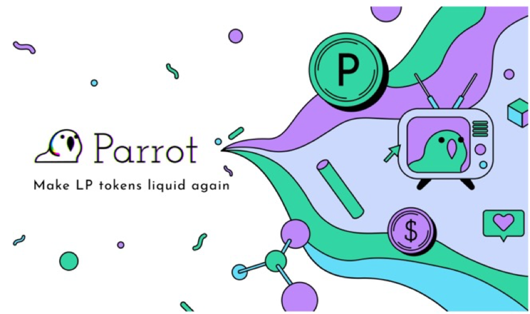
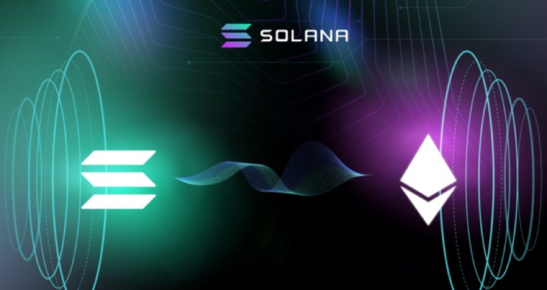
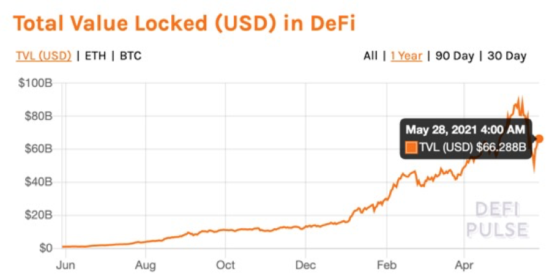
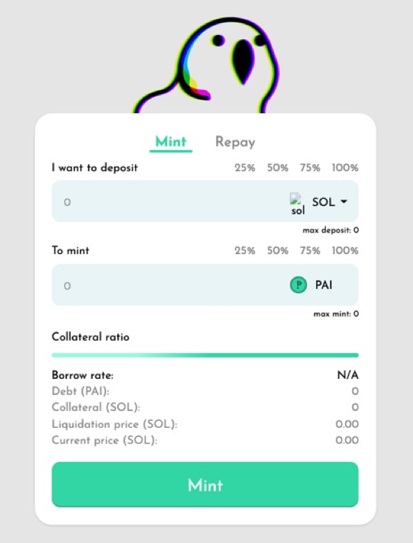
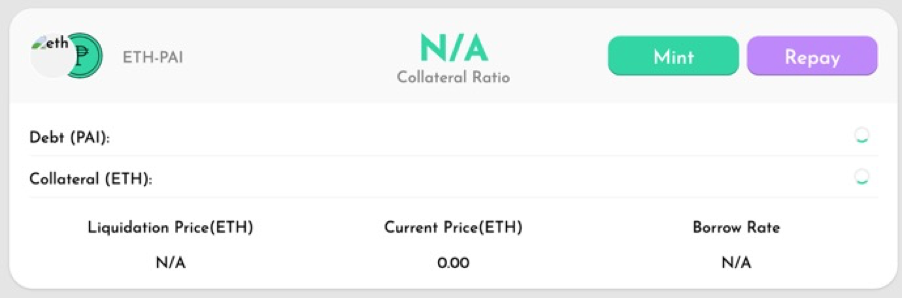
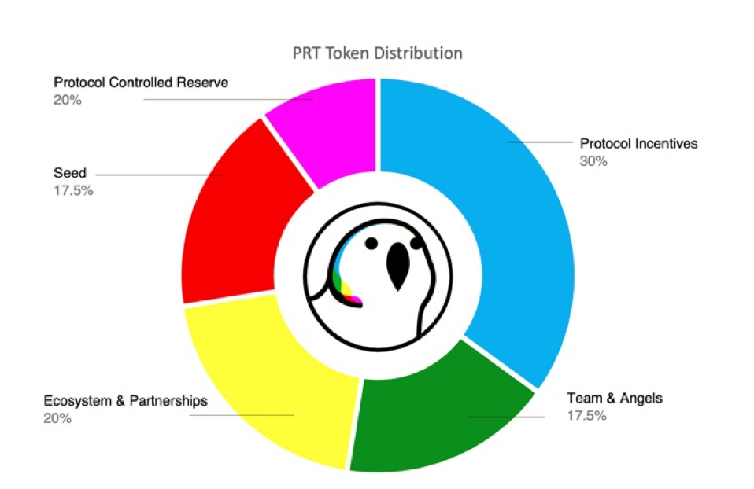
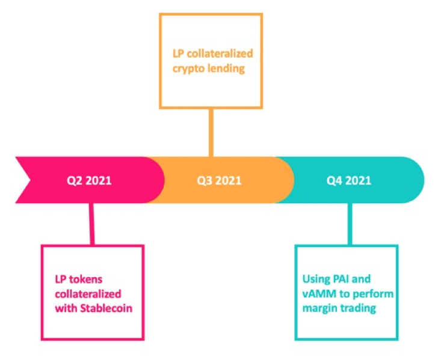
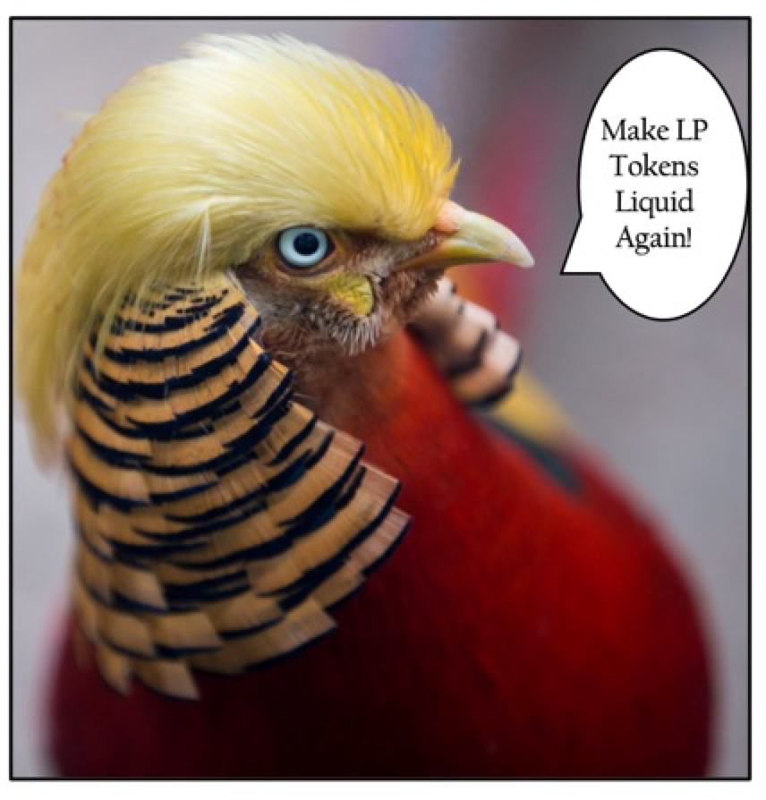

# 

# **Parrot Protocol**

By Rahul Nandwani May 28th 2021

It’s a bird…. It’s a plane... It’s a parrot! 

Many people had recognized blockchain's possibilities for improving organisational operations, offering transactional transparency and security throughout the value chain, and lowering operational costs for several years. Despite this, the envisaged mass adoption had yet to take place up until the DeFi summer of 2020. What was holding it back? In fact, there have been a number of issues in recent years that have stymied widespread acceptance. However, interoperability is by far the most generally acknowledged concern. Or, to be more precise, the lack of it. Although blockchain was designed to be a decentralized technology, individual blockchain ecosystems are not naturally open and are incapable of communicating with one another effectively. Multiple networks and financial organizations have radically different governance standards, blockchain technology versions, and regulatory regulations, which exacerbates the situation.  

Blockchain interoperability is the ability to share information across various blockchain systems or networks (Geroni, 2020). Analogically, it requires a bridge or “chain link”, that can connect and facilitate the free movement of tokenized assets from one ecosystem to another. Ethereum, which is the goliath of ecosystems with a market cap of almost $794.4 billion, dwarfs Solana’s which stands at roughly $38 billion. However, it's no secret that Solana’s lightning speed and inexpensive fees scale as the ecosystem grows. This is done without sacrificing censorship resistance or security. No prizes for guessing that a multitude of users, bogged by Ethereum’s speed and costs, want to make the shift to Solana. To meet the ever-growing demand, more cross-chain bridge projects are surfacing. One such project is Wormhole, which uses decentralized cross-chain oracles — called guardians — operated by a set of node operators that include top Solana validators and other ecosystem stakeholders whose incentives are strongly aligned with Solana and Serum (Schabel, 2020). 

But all that glitters is not gold. One of the integral issues with cross-chain bridges and the transmission of assets from the Ethereum decentralized finance network onto the Solana decentralized finance network is the creation of an opportunity cost for users. This being the loss of potential yields on Ethereum. Due to Solana being a fairly new DeFi ecosystem, this creates a chicken or the egg causality dilemma. One of the best litmus tests for measuring the robustness of the yield farming scene is the total value locked (TVL). It measures how much crypto is locked in DeFi[ lending](https://academy.binance.com/en/articles/the-ultimate-guide-to-earning-crypto-with-binance-lending) and other types of money marketplaces (Binance Academy, 2021). To a certain extent, TVL is the aggregate liquidity in liquidity pools (Binance Academy, 2021). It’s a valuable barometer to measure the health of the DeFi and yield farming market as a whole. However, for Solana DeFi, it is a conundrum as yield is low due to a lack of total value locked. Reciprocally due to a low TVL, yield is low as well and thus the paradox. Enter the party parrot. 

## **Technology**

Parrot finance announced their Parrot Protocol on the Solana blockchain after placing 2nd place in the Solana x Serum DeFi Hackathon. The Solana x Serum DeFi Hackathon was participated in by more than 3,000 builders and over 100 projects were submitted. Led by their surreptitious head developer, Mr Parrot, Party Parrot Finance is a non-custodial lending and borrowing protocol that is fitted with their own Virtual Automated Market Maker (vAMM). Parrot protocol’s main objective is to enable the liquidity to be cultivated once more, by increasing accessibility to the value stored in DeFi liquidity pools. 

Currently, billions of dollars are locked into DeFi systems and are untouchable. At the time of writing, Defi Pulse estimated the total value locked in DeFi stands at $66.28 billion. Although down from an all-time high of $88.892 billion on the 12th of May, this still stands as a colossal amount. This is largely owing to the small number of use cases LP tokens are able to be utilised for, by virtue of their opaque risk structure and unsuitable units. Parrot is an LP-token collateralized liquidity and lending platform that wants to tackle this issue head-on. All three of the services Parrot Finance offers such as the stablecoin titled “PAI”, their non-custodial lending market and their margin trading virtual automated market maker (vAMM) all strive to solve the crux of turning the illiquid to liquid again. 

Image Credit: https://defipulse.com/ 

### PAI Stablecoin

Parrot Protocol’s plan to unlock the accessibility in LP tokens is guided by their three-pronged plan, the first of which is heavily centred around their own stablecoin titled “PAI”. The “PAI” stablecoin is the Parrot’s pioneer product and is built on Solana. Stablecoins are a class of crypto assets that attempt to peg their market value to an external reference point and attempt to offer price stability. Parrot aims to generate the PAI stablecoin that is backed by LPs as collateral. This will make it easy for users who hold different types of LP tokens to conduct transactions with one another through a common unit of account like PAI. It is currently available on[ https://partyparrot.finance](https://partyparrot.finance/) for devnet testing. 

The PAI stablecoin will have several use cases. They can be employed to stake an individual’s Ethereum or Bitcoin on a layer 1 (L1) swap to earn LP yields. They can further be deployed to bridge one’s LP tokens from any DeFi network, to be integrated into Solana. One of the features on Parrot currently is the mint feature. It can mint PAI stablecoins through the collateralization of one’s LP tokens. Likewise, more ethereum and bitcoin can be purchased using PAI stablecoins on the Serum network as well. In summation, individuals are able to simultaneously continue to yield farms on Ethereum layer 1 as well as participating in new yield farms on Solana DeFi with the PAI stablecoin. This accentuates maximum capital efficiency.

Image Credit: https://partyparrot.finance/mint/

### Parrot Lending Market & vMMA 

Similar to the PAI stablecoin, the Parrot Lending Market will also hold lP tokens as collateral. The protocol intends to make it feasible to deploy collaterals to generate synthetic assets as debts. Similar to Maker, it will recognize a wide variety of assets as collateral, and will be capable of generating various types of synthetic assets. This will permit LP holders to access and leverage their locked value by taking on a debt against lender liquidity and enable the no-loss conversion between synthetics. Additionally, by adopting a base and common unit such as the PAI stablecoin, the margin trading vMMA will make transactions simple. 

Image Credit: https://partyparrot.finance/vaults/

## Tokenomics

### Business Model

For the long term financial sustainability of the protocol, Parrot finance intends to inculcate an adeptly functioning business model that can consecutively earn fees and support the users of the protocol in a positive feedback loop. Parrot will gather the respective fees for the services it renders. These fees will be directed to purchase back more PRT from the open market and channelled back for redistribution on Parrot as protocol incentives. The fees will be sourced from several locations. 

Firstly stability fees will be collected on the PAI stablecoin. Stability fees are risk mitigators developed in accordance with the potential risk in generating PAI stablecoins against collateral in Parrot vaults. The second fees will be charged from interests accrued from the borrowing of PAI stablecoin supply. Thirdly, fees will be acquired from liquidation penalties, which occur when the individual is unable to fulfil the margin on a leveraged position. Fourthly, fees will be collected on the lending market. And lastly, fees will be amassed from trading on the vMM as it does not require LPs as collateral and thus the protocol is able fetch the entire trading fee. PRT tokens will be used to ensure the stability of the system by incentivizing an insurance pool. This insurance pool may be used to backstop any shortfall in the lending market.

### Token Distribution

Symbol: PRT
Total Supply: 1,000,000,000

* Protocol incentives: 35%
* Team & Angels: 17.5% (1–3 year lockup)
* Ecosystem & Partnerships: 20%
* Seed: 17.5% (1–3 year lockup)
* Protocol Controlled Reserve: 10%

### Governance

With decentralization, there also comes responsibility. To promote long-term active community involvement, holders of PRT who decide to lock up their tokens will obtain gPRT or governance tokens in exchange. Governance tokens are tokens that developers create to allow token holders to help shape the future of a protocol (Coinmarketcap, 2021). Governance token holders can have an impact on project decisions including suggesting or selecting on new feature ideas, as well as modifying the governance system itself. The amount of gPRT tokens produced will be incrementally increased according to the amount of time the PRT tokens are locked. The holders of these gPRT coins will have more voting power as well as increased protocol incentives. The rate is as follows;

* 1 year: 1x (gPRT1)
* 2 years: 1.5x (gPRT2)
* 3 years: 2x (gPRT3)
* 4 years: 4x (gPRT4)

## Roadmap

The Parrot party is one that will change up the value of LPs for good. As an orange-tinted, carrot looking parrot with bad hair once said: We are going to make LP tokens liquid again!

